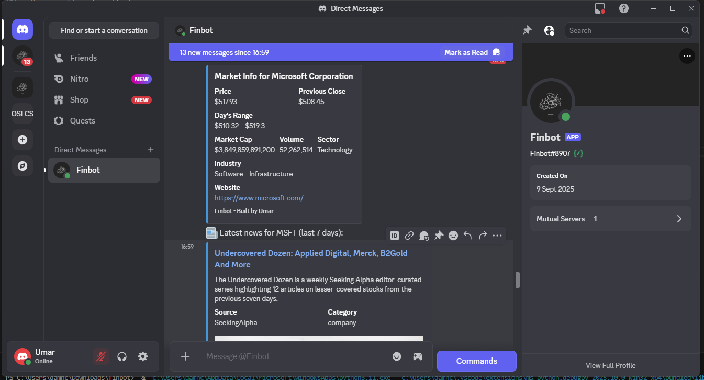
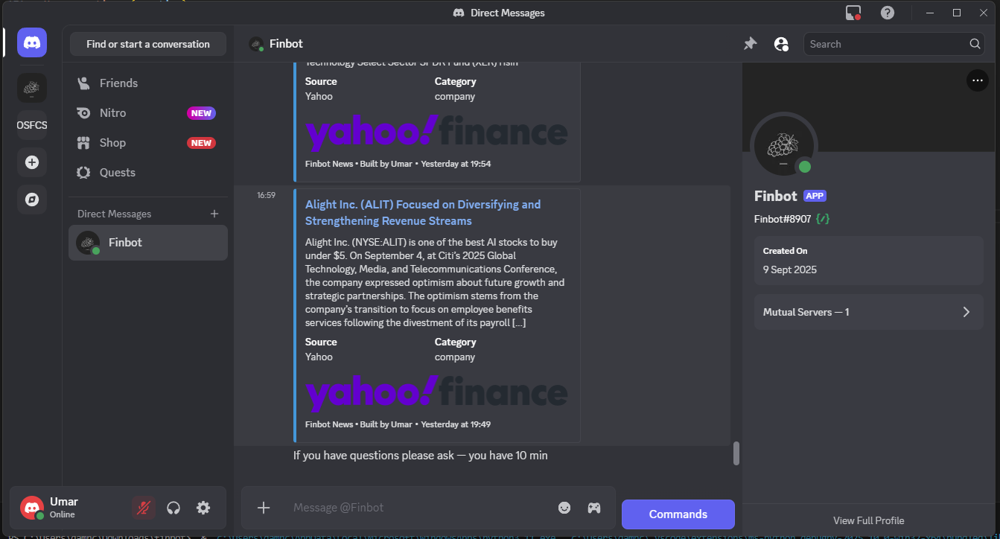

## FinBot — Discord Finance Assistant 🚀

FinBot is a lightweight Discord assistant that fetches live market data and news for stocks & crypto, formats them into rich Discord messages, and runs short DM Q&A sessions powered by Google language model Gemini. (language model is not required it just being used incase the user wants to discuss whats being shared)

## License

MIT — use it freely: fork, adapt, and run on your servers. Attributions welcome but not required.

## Server

Quick TL;DR

Type ready in a server channel → pick Stocks or Crypto → pick a ticker → pick a time window → FinBot DMs market info + summarized news. 

After the DM package you get a 10-minute Q&A session (Gemini-powered) for follow-ups. No database, no persistent subscriptions — session-driven and easy to run.

## Market info

Features ✨

Interactive message flow: ready → Stocks/Crypto → ticker → duration → DM package

Market info from yfinance + Finnhub quotes

Deduplicated Finnhub company/crypto news delivered as rich embeds (image, headline, summary, source)

Google Gemini for contextual analysis & summarisation in DM Q&A

Handles long LLM responses by chunking to respect Discord limits

Simple codebase designed for easy modification and extension

## Built in Assistant

## Tech stack

Python 3.10+ · discord.py · finnhub-python · yfinance · Google language model Genai · python-dotenv

One-line install & run
git clone https://github.com/Grape-716/finbot-public

## Commands / How to use

ready — start an interactive session (message + buttons)

!ping — health check (responds Pong!)

!help_finance — basic help embed

## User flow:

Type ready in a server channel where the bot is invited.

Click Stocks or Crypto → choose a ticker → choose a duration (6h / 3d / 7d / 14d).

Check your DMs for: market info embed + up to N news embeds.

Ask follow-up questions in DM for up to 10 minutes make sure its finnace related. (asking for live price is avaliable)

## Rate limits & cost notes ⚠️

Finnhub free tier has rate limits — avoid tight polling and only fetch what you need.

Gemini/LLM calls cost money — summarise only top N articles (e.g., 3) or implement a per-user quota.

If deploying for many users, add caching & group fetches per symbol.

## Minimal requirements.txt
discord.py>=2.2.0 -- finnhub-python -- yfinance -- google language model -- python-dotenv

## Author

Umar — Aspiring software developer & Python Engineer
GitHub: https://github.com/Grape-716
 · Portfolio: https://ikrprofile.netlify.app
